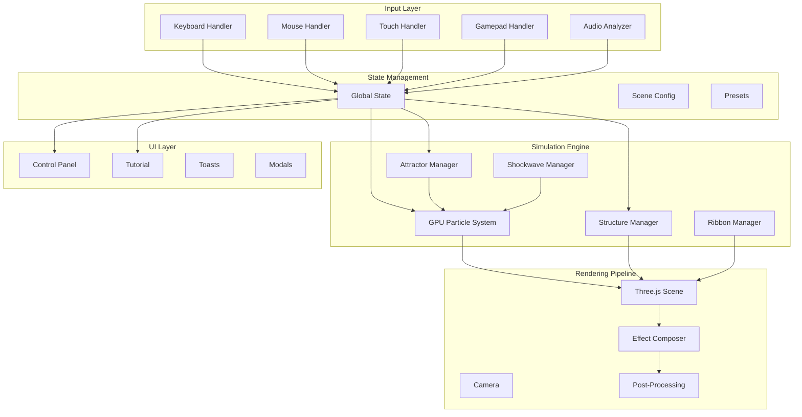

# LuminousFlow - Features & Gameplay Enhancement Plan

## Executive Summary

Following the successful completion of the graphics overhaul (Batches 1-4), this plan identifies opportunities to enhance gameplay, functionality, features, and mechanics. The focus shifts from visual polish to interactive depth, user experience, and simulation capabilities.

---

## Current System Analysis

### Implemented Features (Graphics Overhaul Complete)

| Component | Status | Details |
|-----------|--------|---------|
| GPU Particle System | ✅ Complete | 65K-262K particles via GPGPU |
| Mouse Attractor | ✅ Complete | Particles follow cursor |
| Click Shockwaves | ✅ Complete | Expanding ripple effects |
| Wave Grid | ✅ Complete | 16K particles, simplex noise |
| Geometric Structures | ✅ Complete | 5 types with animations |
| Light Ribbons | ✅ Complete | 4 curve patterns |
| Post-Processing | ✅ Complete | Bloom, chromatic aberration, grain, FXAA |
| Quality Manager | ✅ Complete | FPS-based adaptive quality |
| Background Manager | ✅ Complete | Gradient, nebula, solid |

### Identified Gaps & Unused Code

1. **Attractor Class** - Defined but only used for mouse; supports `vortex` and `orbit` types not exposed
2. **Gravity/Direction State** - `gravityDirection` state exists but never applied to physics
3. **Multiple Shockwaves** - ShockwaveManager supports 5, but only 1 passed to shader
4. **Deprecated Emitter** - Old ParticleEmitter class has unused trail rendering logic

---

## PHASE 1: Interaction & Input Enhancements

### 1.1 Keyboard Shortcuts System

**Priority:** High | **Complexity:** Low

Add keyboard controls for rapid access to common actions.

```javascript
// Proposed keybindings
const KEYBOARD_SHORTCUTS = {
  'Space': 'triggerShockwave',      // Pulse at center
  'R': 'randomize',                  // Randomize scene
  'C': 'clearScene',                 // Clear all objects
  'H': 'toggleUI',                   // Hide/show control panel
  'F': 'toggleFullscreen',           // Fullscreen mode
  'P': 'togglePause',                // Pause animation
  '1-6': 'selectPalette',            // Quick palette switch
  '+/-': 'adjustQuality',            // Quality up/down
  'M': 'toggleMouseFollow',          // Toggle mouse attractor
  'G': 'toggleWaveGrid',             // Toggle wave grid
  'Escape': 'resetCamera'            // Reset camera position
};
```

**Implementation:**
- Add `useEffect` with `keydown` event listener
- Create action dispatcher function
- Add visual feedback for key presses (toast notifications)

### 1.2 Touch & Mobile Gesture Support

**Priority:** High | **Complexity:** Medium

Enable multi-touch interactions for mobile/tablet users.

| Gesture | Action |
|---------|--------|
| Single tap | Trigger shockwave at position |
| Double tap | Add structure at position |
| Two-finger pinch | Zoom camera |
| Two-finger rotate | Orbit camera |
| Long press | Open context menu |
| Swipe left/right | Cycle color palettes |
| Three-finger swipe | Toggle UI visibility |

**Implementation:**
- Detect touch device with `'ontouchstart' in window`
- Use `TouchEvent` handlers alongside mouse events
- Implement gesture recognition for multi-touch

### 1.3 Gamepad Controller Support

**Priority:** Low | **Complexity:** Medium

Support game controllers for immersive exploration.

```javascript
// Gamepad mapping
const GAMEPAD_CONTROLS = {
  leftStick: 'cameraOrbit',
  rightStick: 'cameraZoom',
  A: 'triggerShockwave',
  B: 'randomize',
  X: 'toggleMouseFollow',
  Y: 'toggleWaveGrid',
  LB: 'prevPalette',
  RB: 'nextPalette',
  dpadUp: 'qualityUp',
  dpadDown: 'qualityDown'
};
```

### 1.4 Attract Mode / Screensaver

**Priority:** Medium | **Complexity:** Low

Auto-play mode that cycles through configurations.

```javascript
class AttractMode {
  constructor(actions) {
    this.actions = actions;
    this.interval = 30000; // 30 seconds per scene
    this.enabled = false;
  }
  
  start() {
    this.enabled = true;
    this.scheduleNextAction();
  }
  
  scheduleNextAction() {
    if (!this.enabled) return;
    
    // Randomly select action: palette change, add structure, randomize
    const action = this.actions[Math.floor(Math.random() * this.actions.length)];
    action();
    
    setTimeout(() => this.scheduleNextAction(), this.interval);
  }
}
```

---

## PHASE 2: Particle System Extensions

### 2.1 Multiple Attractor Types

**Priority:** High | **Complexity:** Medium

Expose the existing Attractor class types to users.

**Current types (in code but unused):**
- `point` - Direct attraction (implemented)
- `vortex` - Spiral motion around axis
- `orbit` - Stable orbital paths

**New types to add:**
- `repulsor` - Push particles away
- `turbulence` - Chaotic force field
- `gravity_well` - Realistic inverse-square gravity

**UI Addition:**
```jsx
<Section title="Attractors">
  <button onClick={() => addAttractor('point')}>+ Point Attractor</button>
  <button onClick={() => addAttractor('vortex')}>+ Vortex</button>
  <button onClick={() => addAttractor('orbit')}>+ Orbit Ring</button>
  <button onClick={() => addAttractor('repulsor')}>+ Repulsor</button>
  {attractors.map((a, i) => (
    <AttractorPanel key={i} attractor={a} onUpdate={updateAttractor} />
  ))}
</Section>
```

### 2.2 Particle Trails

**Priority:** Medium | **Complexity:** High

Render motion trails behind particles using line segments.

**Approach 1: GPU-based trails**
- Store N previous positions in additional textures
- Render as line primitives or thin quads

**Approach 2: Post-processing trail**
- Use motion blur with frame accumulation
- Lighter on GPU but less precise

```glsl
// Trail rendering shader concept
uniform sampler2D currentPositions;
uniform sampler2D previousPositions1;
uniform sampler2D previousPositions2;

void main() {
  // Draw line from previous to current position
  // Fade alpha based on trail segment age
}
```

### 2.3 Velocity-Based Particle Coloring

**Priority:** Medium | **Complexity:** Low

Enhance color mapping to include acceleration and direction.

**Current:** Color based on speed magnitude only
**Enhanced:**
- Direction-based hue shift (velocity.x/y/z components)
- Acceleration highlighting (sudden changes)
- Age-based color gradients

```glsl
// Enhanced color calculation
vec3 velocityDir = normalize(vel.xyz);
float speed = length(vel.xyz);
float accel = length(vel.xyz - prevVel.xyz);

// Map direction to hue
float hue = atan(velocityDir.z, velocityDir.x) / 6.28 + 0.5;

// Highlight acceleration
vec3 accelColor = mix(baseColor, vec3(1.0, 0.5, 0.0), accel * 0.5);
```

### 2.4 Wind/Turbulence Forces

**Priority:** Medium | **Complexity:** Low

Add directional wind and turbulence controls.

```javascript
// New velocity uniforms
this.velocityUniforms.uWindDirection = { value: new THREE.Vector3(1, 0, 0) };
this.velocityUniforms.uWindStrength = { value: 0.0 };
this.velocityUniforms.uTurbulenceScale = { value: 1.0 };
this.velocityUniforms.uTurbulenceIntensity = { value: 0.5 };
```

### 2.5 Particle-Structure Collision

**Priority:** Low | **Complexity:** High

Particles bounce off geometric structures.

**Implementation:**
- Pass structure bounding spheres to velocity shader
- Calculate distance to each structure
- Apply reflection/deflection when within bounds

---

## PHASE 3: Structure & Object Enhancements

### 3.1 Interactive Structures

**Priority:** High | **Complexity:** Medium

Allow direct manipulation of structures.

| Interaction | Action |
|-------------|--------|
| Click | Select structure, show controls |
| Drag | Move structure position |
| Shift+Drag | Scale structure |
| Ctrl+Click | Cycle color |
| Right-click | Context menu (delete, duplicate, etc.) |

**Implementation:**
- Raycasting to detect structure intersection
- Transform controls overlay (like Three.js TransformControls)
- Visual selection indicator (glow/outline)

### 3.2 Energy Beams Between Structures

**Priority:** Medium | **Complexity:** Medium

Connect structures with animated energy lines.

```javascript
class EnergyBeam {
  constructor(structureA, structureB, color) {
    this.source = structureA;
    this.target = structureB;
    this.curve = new THREE.QuadraticBezierCurve3(...);
    this.tube = new THREE.TubeGeometry(this.curve, ...);
    // Animated shader with flowing energy
  }
  
  update(time) {
    // Recalculate curve based on structure positions
    // Update flow animation
  }
}
```

### 3.3 Additional Structure Types

**Priority:** Medium | **Complexity:** Medium

Expand the geometric vocabulary.

**New Types:**
- `tetrahedron` - Simplest platonic solid
- `octahedron` - Dual of cube
- `dodecahedron` - Already used internally
- `fractal_tree` - Recursive branching
- `sierpinski` - Sierpinski pyramid
- `menger` - Menger sponge
- `klein_bottle` - Non-orientable surface
- `trefoil_knot` - Mathematical knot

### 3.4 Structure Morphing Transitions

**Priority:** Low | **Complexity:** High

Animate smooth transitions between structure types.

```javascript
morphStructure(fromType, toType, duration = 1.0) {
  // Calculate vertex correspondence
  // Interpolate positions over duration
  // Handle vertex count mismatches with vertex splitting/merging
}
```

---

## PHASE 4: Audio Reactivity System

### 4.1 Web Audio API Integration

**Priority:** High | **Complexity:** Medium

React to microphone input or audio files.

```javascript
class AudioAnalyzer {
  constructor() {
    this.audioContext = new AudioContext();
    this.analyser = this.audioContext.createAnalyser();
    this.analyser.fftSize = 256;
    this.dataArray = new Uint8Array(this.analyser.frequencyBinCount);
  }
  
  connectMicrophone() {
    navigator.mediaDevices.getUserMedia({ audio: true })
      .then(stream => {
        const source = this.audioContext.createMediaStreamSource(stream);
        source.connect(this.analyser);
      });
  }
  
  getFrequencyData() {
    this.analyser.getByteFrequencyData(this.dataArray);
    return {
      bass: this.getRange(0, 10),      // 0-300Hz
      mid: this.getRange(10, 50),       // 300-1500Hz
      high: this.getRange(50, 128),     // 1500Hz+
      overall: this.getOverallVolume()
    };
  }
}
```

**Audio-reactive mappings:**
| Audio Feature | Visual Response |
|---------------|-----------------|
| Bass | Shockwave trigger, structure pulse |
| Mid | Particle speed/turbulence |
| High | Chromatic aberration, color shift |
| Beat detection | Camera shake, bloom spike |
| Overall volume | Wave grid amplitude |

### 4.2 Built-in Ambient Audio

**Priority:** Low | **Complexity:** Low

Add optional ambient soundtrack.

---

## PHASE 5: Scene & Preset Management

### 5.1 Save/Load Scene Configurations

**Priority:** High | **Complexity:** Medium

Export and import complete scene state.

```javascript
const sceneConfig = {
  version: '1.0',
  palette: 'Northern Lights',
  background: 'nebula',
  timeScale: 1.0,
  bloom: { strength: 1.5, radius: 0.8 },
  particles: {
    attractorStrength: 3.0,
    mouseFollow: true,
    autoPulse: true
  },
  structures: [
    { type: 'icosahedron', position: [0,0,0], scale: 1, ... }
  ],
  ribbons: [
    { type: 'helix', color: '#00ffaa', ... }
  ],
  camera: {
    position: [0, 2, 8],
    target: [0, 0, 0]
  }
};

// Save to localStorage
localStorage.setItem('luminousFlow_scene', JSON.stringify(sceneConfig));

// Export as file
const blob = new Blob([JSON.stringify(sceneConfig, null, 2)], { type: 'application/json' });
const url = URL.createObjectURL(blob);
```

### 5.2 Preset Scene Gallery

**Priority:** Medium | **Complexity:** Low

Curated preset configurations.

```javascript
const SCENE_PRESETS = {
  'Cosmic Dance': {
    palette: 'Deep Ocean',
    background: 'nebula',
    structures: [
      { type: 'rings', scale: 1.5 },
      { type: 'icosahedron', scale: 0.5 }
    ],
    // ...
  },
  'Solar Flare': {
    palette: 'Solar Corona',
    background: 'gradient',
    // ...
  },
  'Digital Dreams': {
    palette: 'Synthwave',
    structures: [
      { type: 'helix', scale: 2 },
      { type: 'torus', scale: 0.8 }
    ],
    // ...
  }
};
```

### 5.3 Screenshot & Recording

**Priority:** Medium | **Complexity:** Medium

Capture high-resolution images and videos.

```javascript
// Screenshot
function captureScreenshot(resolution = 4) {
  const originalSize = renderer.getSize(new THREE.Vector2());
  renderer.setSize(originalSize.x * resolution, originalSize.y * resolution);
  composer.render();
  
  const dataUrl = renderer.domElement.toDataURL('image/png');
  
  renderer.setSize(originalSize.x, originalSize.y);
  
  // Download
  const link = document.createElement('a');
  link.download = `luminous-flow-${Date.now()}.png`;
  link.href = dataUrl;
  link.click();
}

// Video recording using MediaRecorder
function startRecording() {
  const stream = renderer.domElement.captureStream(60);
  const recorder = new MediaRecorder(stream, { mimeType: 'video/webm' });
  const chunks = [];
  
  recorder.ondataavailable = e => chunks.push(e.data);
  recorder.onstop = () => {
    const blob = new Blob(chunks, { type: 'video/webm' });
    // Download or process
  };
  
  recorder.start();
  return recorder;
}
```

---

## PHASE 6: Simulation Modes

### 6.1 N-Body Gravity Simulation

**Priority:** Medium | **Complexity:** High

Replace particle physics with gravitational interaction.

```glsl
// N-body gravity (simplified - real implementation needs optimization)
vec3 gravity = vec3(0.0);
for (int i = 0; i < NUM_BODIES; i++) {
  vec3 toBody = bodies[i].position - pos.xyz;
  float dist = length(toBody);
  if (dist > 0.5) {
    gravity += normalize(toBody) * bodies[i].mass / (dist * dist);
  }
}
vel.xyz += gravity * G * uDelta;
```

### 6.2 Flocking/Boids Behavior

**Priority:** Medium | **Complexity:** Medium

Implement classic boids algorithm on GPU.

**Three rules:**
1. Separation - avoid crowding neighbors
2. Alignment - steer toward average heading
3. Cohesion - steer toward average position

```glsl
// Boids velocity calculation
vec3 separation = vec3(0.0);
vec3 alignment = vec3(0.0);
vec3 cohesion = vec3(0.0);
int neighborCount = 0;

// Sample nearby particles (limited for performance)
for (int i = 0; i < SAMPLE_COUNT; i++) {
  vec2 sampleUv = getRandomNeighborUV(uv, i);
  vec4 neighborPos = texture2D(texturePosition, sampleUv);
  vec4 neighborVel = texture2D(textureVelocity, sampleUv);
  
  float dist = distance(pos.xyz, neighborPos.xyz);
  if (dist < NEIGHBOR_RADIUS && dist > 0.01) {
    separation += normalize(pos.xyz - neighborPos.xyz) / dist;
    alignment += neighborVel.xyz;
    cohesion += neighborPos.xyz;
    neighborCount++;
  }
}

if (neighborCount > 0) {
  alignment = normalize(alignment / float(neighborCount));
  cohesion = normalize((cohesion / float(neighborCount)) - pos.xyz);
}

vel.xyz += separation * SEPARATION_WEIGHT;
vel.xyz += alignment * ALIGNMENT_WEIGHT;
vel.xyz += cohesion * COHESION_WEIGHT;
```

### 6.3 Fluid Simulation Mode

**Priority:** Low | **Complexity:** Very High

SPH (Smoothed Particle Hydrodynamics) for fluid-like behavior.

### 6.4 Reaction-Diffusion Patterns

**Priority:** Low | **Complexity:** Medium

Gray-Scott reaction-diffusion on particle field.

---

## PHASE 7: Visual Effects Additions

### 7.1 Depth of Field

**Priority:** Medium | **Complexity:** Medium

Focus effect with bokeh.

```javascript
import { BokehPass } from 'three/examples/jsm/postprocessing/BokehPass.js';

const bokehPass = new BokehPass(scene, camera, {
  focus: 8.0,
  aperture: 0.025,
  maxblur: 0.01
});
composer.addPass(bokehPass);
```

### 7.2 Motion Blur

**Priority:** Low | **Complexity:** High

Per-object motion blur using velocity buffer.

### 7.3 Volumetric Light Rays

**Priority:** Medium | **Complexity:** High

God rays emanating from bright sources.

```glsl
// Volumetric light rays shader concept
uniform vec2 lightScreenPos;
uniform float density;
uniform float decay;

void main() {
  vec2 dir = vUv - lightScreenPos;
  vec2 sampleUv = vUv;
  vec3 color = vec3(0.0);
  float illumination = 1.0;
  
  for (int i = 0; i < NUM_SAMPLES; i++) {
    sampleUv -= dir * STEP_SIZE;
    color += texture2D(tDiffuse, sampleUv).rgb * illumination;
    illumination *= decay;
  }
  
  gl_FragColor = texture2D(tDiffuse, vUv) + vec4(color * density, 0.0);
}
```

### 7.4 Lens Flare

**Priority:** Low | **Complexity:** Low

Add lens flare to bright spots.

```javascript
import { Lensflare, LensflareElement } from 'three/examples/jsm/objects/Lensflare.js';

const textureFlare = new THREE.TextureLoader().load('textures/lensflare.png');
const lensflare = new Lensflare();
lensflare.addElement(new LensflareElement(textureFlare, 512, 0));
```

---

## PHASE 8: UX & Accessibility

### 8.1 Onboarding Tutorial

**Priority:** High | **Complexity:** Low

First-time user guidance.

```jsx
const TutorialOverlay = ({ step, onNext, onSkip }) => (
  <div className="tutorial-overlay">
    {step === 1 && (
      <div className="tutorial-step">
        <h3>Welcome to Luminous Flow!</h3>
        <p>Click anywhere to create a shockwave</p>
        <button onClick={onNext}>Next</button>
      </div>
    )}
    {step === 2 && (
      <div className="tutorial-step">
        <h3>Mouse Interaction</h3>
        <p>Move your cursor to attract particles</p>
        <button onClick={onNext}>Next</button>
      </div>
    )}
    {/* ... more steps */}
  </div>
);
```

### 8.2 Reduced Motion Mode

**Priority:** Medium | **Complexity:** Low

Accessibility option for motion sensitivity.

```javascript
const reducedMotionQuery = window.matchMedia('(prefers-reduced-motion: reduce)');

if (reducedMotionQuery.matches) {
  setTimeScale(0.3);
  setAutoPulse(false);
  setChromaticAberration(false);
  setFilmGrain(false);
}
```

### 8.3 High Contrast Mode

**Priority:** Low | **Complexity:** Low

Increase visibility for low-vision users.

### 8.4 Toast Notifications

**Priority:** Medium | **Complexity:** Low

Visual feedback for actions.

```jsx
const Toast = ({ message, type, duration = 2000 }) => {
  // Auto-dismiss after duration
  // Types: success, info, warning
};

// Usage
showToast('Quality increased to High', 'info');
showToast('Screenshot saved', 'success');
```

---

## Implementation Priority Matrix

```
                    HIGH VALUE
                        │
    Keyboard Shortcuts  │  Audio Reactivity
    Touch Support       │  Save/Load Scenes
    Multiple Attractors │  Interactive Structures
    Tutorial            │  Energy Beams
                        │
LOW EFFORT ─────────────┼───────────────── HIGH EFFORT
                        │
    Reduced Motion      │  Particle Trails
    Toast Notifications │  N-Body Simulation
    Preset Gallery      │  Fluid Simulation
    Gamepad Support     │  Structure Morphing
                        │
                    LOW VALUE
```

---

## Recommended Implementation Batches

### Batch A: Quick Wins (1-2 features per session)
1. Keyboard shortcuts
2. Toast notifications
3. Reduced motion mode
4. Preset gallery

### Batch B: Interaction Layer
1. Touch/gesture support
2. Interactive structures (selection, dragging)
3. Multiple attractor types UI
4. Particle velocity coloring

### Batch C: Audio & Media
1. Audio reactivity system
2. Screenshot capture
3. Video recording
4. Built-in ambient audio

### Batch D: Advanced Simulation
1. Boids/flocking mode
2. N-body gravity
3. Particle trails
4. Particle-structure collision

### Batch E: Visual Polish
1. Depth of field
2. Volumetric light rays
3. Energy beams between structures
4. Additional structure types

### Batch F: Persistence & Sharing
1. Save/load configurations
2. Export/import scenes
3. Share links (URL parameters)
4. Scene versioning

---

## Architecture Diagram



---

## Summary

This plan outlines a comprehensive roadmap for enhancing LuminousFlow beyond its current graphics capabilities. The focus areas are:

1. **Interaction** - Keyboard, touch, gamepad, and audio input
2. **Particle Physics** - Multiple attractors, trails, advanced coloring
3. **Structures** - Interactive manipulation, new types, connections
4. **Audio** - Real-time reactivity to sound
5. **Persistence** - Save/load/share scenes
6. **Simulation** - Alternative physics modes (boids, gravity, fluid)
7. **Visual** - Additional post-processing effects
8. **UX** - Tutorial, accessibility, feedback

The recommended approach is to implement in batches, starting with quick wins that immediately improve usability, then progressing to more complex features.
