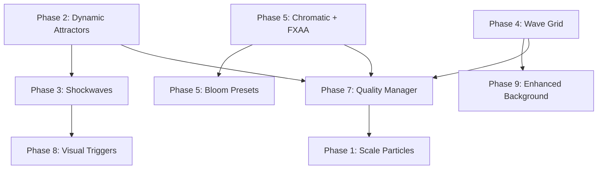
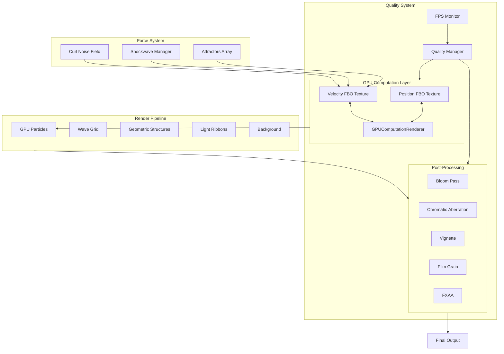

# Luminous Flow - Graphics Overhaul Implementation Plan

## Executive Summary

This document outlines the remaining implementation work needed to transform the Luminous Flow visualization into a demoscene-grade, GPU-accelerated visual experience. A significant portion of the foundation has already been implemented with the recent PR, but several key features remain.

---

## Current Implementation Status

### What Has Been Completed

| Phase | Feature | Status | Notes |
|-------|---------|--------|-------|
| 1 | GPGPU Particle System | **75% Complete** | Core system working with 65K particles |
| 1 | Position/Velocity FBO Textures | ✅ Complete | Using GPUComputationRenderer |
| 1 | Particle Render Shaders | ✅ Complete | Life-based alpha, speed-based color |
| 5 | Post-Processing Stack | **60% Complete** | Bloom, vignette, film grain working |
| 6 | Curl Noise | ✅ Complete | Full simplex + curl noise in shaders |
| 9 | Background System | **50% Complete** | Gradient and basic nebula implemented |

### What Remains to be Implemented

| Phase | Feature | Priority | Complexity |
|-------|---------|----------|------------|
| 1 | Scale to 100K+ particles | Medium | Low |
| 2 | Dynamic Attractors System | **High** | Medium |
| 3 | Shockwave/Ripple Effects | **High** | Medium |
| 4 | Particle Wave Grid | Medium | Medium |
| 5 | Chromatic Aberration | Medium | Low |
| 5 | FXAA Anti-aliasing | Low | Low |
| 5 | Bloom Presets per Palette | Low | Low |
| 7 | Adaptive Quality System | Medium | Medium |
| 8 | Visual Effect Triggers | **High** | Low |
| 9 | Enhanced Nebula Background | Low | Medium |

---

## Detailed Implementation Plan

### PHASE 1: GPGPU Particle System Enhancements

**Current State:** The [`GPUParticleSystem`](src/LuminousFlow.jsx:476) class is functional with 65,536 particles using a 256x256 texture.

**Remaining Work:**

1. **Scale particle count to 100,000+**
   - Change texture size from 256 to 320 for 102,400 particles
   - Or use 512 for 262,144 particles in ultra quality mode
   - Location: [`GPUParticleSystem` constructor](src/LuminousFlow.jsx:477) - change `SIZE` parameter

2. **Add configurable particle count**
   - Allow quality presets to control particle count
   - Integrate with Phase 7 Adaptive Quality System

```javascript
// Recommended texture sizes for quality levels
const PARTICLE_SIZES = {
  ultra: 512,    // 262,144 particles
  high: 384,     // 147,456 particles  
  medium: 256,   // 65,536 particles
  low: 192,      // 36,864 particles
  potato: 128    // 16,384 particles
};
```

---

### PHASE 2: Dynamic Attractors System

**Current State:** Only a single central attractor exists in [`velocityUniforms`](src/LuminousFlow.jsx:526-528).

**Implementation Requirements:**

1. **Create Attractor Class**

```javascript
class Attractor {
  constructor(position, strength, type = 'point') {
    this.position = position;      // THREE.Vector3
    this.strength = strength;      // positive = attract, negative = repel
    this.type = type;              // point, vortex, line, orbit
    this.active = true;
    this.radius = 1.0;             // for orbit type
  }
}
```

2. **Attractor Types to Implement:**
   - **Point Attractor:** Spherical pull toward a point - already exists, needs refinement
   - **Vortex Attractor:** Adds tangential velocity for spiral motion
   - **Line Attractor:** Pulls toward an axis
   - **Orbit Attractor:** Maintains particles at a set radius

3. **Multi-Attractor Support:**
   - Pass attractors as a texture or uniform array to velocity shader
   - Modify [`getVelocityShader()`](src/LuminousFlow.jsx:600) to iterate over multiple attractors

4. **Mouse-Follow Attractor:**
   - Add raycasting to convert mouse position to 3D coordinates
   - Update primary attractor position on mousemove

**Files to Modify:**
- [`src/LuminousFlow.jsx`](src/LuminousFlow.jsx) - Add Attractor class after line 878
- Modify velocity shader starting at line 600

---

### PHASE 3: Shockwave / Ripple Effects

**Current State:** Not implemented.

**Implementation Requirements:**

1. **Add Shockwave Uniforms to Velocity Shader:**

```glsl
uniform vec3 uShockwaveOrigin;
uniform float uShockwaveRadius;
uniform float uShockwaveStrength;
uniform float uShockwaveThickness;
```

2. **Add Shockwave Force Calculation:**
   - Location: Inside [`getVelocityShader()`](src/LuminousFlow.jsx:691) main function, before damping

```glsl
// Shockwave force
vec3 toParticle = pos.xyz - uShockwaveOrigin;
float particleDist = length(toParticle);
float shockwaveDist = abs(particleDist - uShockwaveRadius);

if (shockwaveDist < uShockwaveThickness) {
  float shockForce = 1.0 - shockwaveDist / uShockwaveThickness;
  shockForce = shockForce * shockForce * uShockwaveStrength;
  acceleration += normalize(toParticle) * shockForce;
}
```

3. **Create Shockwave Manager:**

```javascript
class ShockwaveManager {
  constructor() {
    this.shockwaves = [];
    this.maxShockwaves = 5;
  }
  
  trigger(origin, strength = 10.0) {
    this.shockwaves.push({
      origin: origin.clone(),
      radius: 0,
      strength: strength,
      thickness: 2.0,
      expansionSpeed: 8.0,
      decay: 0.95
    });
  }
  
  update(deltaTime) {
    for (let i = this.shockwaves.length - 1; i >= 0; i--) {
      const sw = this.shockwaves[i];
      sw.radius += sw.expansionSpeed * deltaTime;
      sw.strength *= sw.decay;
      
      if (sw.radius > 20 || sw.strength < 0.1) {
        this.shockwaves.splice(i, 1);
      }
    }
  }
}
```

4. **Optional: Visual Shockwave Ring**
   - Create expanding ring mesh with fresnel glow shader
   - Fade out as it expands

**Files to Modify:**
- [`src/LuminousFlow.jsx`](src/LuminousFlow.jsx) - Add ShockwaveManager class
- Modify velocity shader uniforms and computation

---

### PHASE 4: Particle Wave Grid

**Current State:** Not implemented.

**Implementation Requirements:**

1. **Create WaveGrid Class:**

```javascript
class WaveGrid {
  constructor(scene, size = 256) {
    this.scene = scene;
    this.SIZE = size;  // 256x256 = 65,536 particles
    this.createGeometry();
    this.createMaterial();
  }
  
  createGeometry() {
    const geometry = new THREE.BufferGeometry();
    const positions = new Float32Array(this.SIZE * this.SIZE * 3);
    const uvs = new Float32Array(this.SIZE * this.SIZE * 2);
    
    for (let i = 0; i < this.SIZE; i++) {
      for (let j = 0; j < this.SIZE; j++) {
        const idx = i * this.SIZE + j;
        positions[idx * 3 + 0] = (i / this.SIZE - 0.5) * 20;
        positions[idx * 3 + 1] = 0;
        positions[idx * 3 + 2] = (j / this.SIZE - 0.5) * 20;
        uvs[idx * 2 + 0] = i / this.SIZE;
        uvs[idx * 2 + 1] = j / this.SIZE;
      }
    }
    
    geometry.setAttribute('position', new THREE.BufferAttribute(positions, 3));
    geometry.setAttribute('uv', new THREE.BufferAttribute(uvs, 2));
    this.geometry = geometry;
  }
}
```

2. **Wave Vertex Shader:**

```glsl
uniform float uTime;
uniform float uWaveAmplitude;
uniform float uWaveFrequency;
uniform float uWaveSpeed;

varying float vHeight;
varying vec2 vUv;

void main() {
  vUv = uv;
  vec3 pos = position;
  
  // Multiple wave layers
  float wave1 = sin(pos.x * uWaveFrequency + uTime * uWaveSpeed) * uWaveAmplitude;
  float wave2 = sin(pos.z * uWaveFrequency * 0.8 + uTime * uWaveSpeed * 1.2) * uWaveAmplitude * 0.7;
  float wave3 = snoise(vec3(pos.xz * 0.5, uTime * 0.3)) * uWaveAmplitude * 0.5;
  
  pos.y = wave1 + wave2 + wave3;
  vHeight = pos.y / (uWaveAmplitude * 2.0) + 0.5;
  
  vec4 mvPosition = modelViewMatrix * vec4(pos, 1.0);
  gl_Position = projectionMatrix * mvPosition;
  gl_PointSize = 3.0 * (300.0 / -mvPosition.z);
}
```

3. **Integration:**
   - Add toggle in UI to enable/disable wave grid
   - Position below main particle system
   - Use complementary colors from palette

**Files to Modify:**
- [`src/LuminousFlow.jsx`](src/LuminousFlow.jsx) - Add WaveGrid class after GPUParticleSystem

---

### PHASE 5: Enhanced Post-Processing

**Current State:** Bloom, vignette, and film grain are working. Missing chromatic aberration and FXAA.

**Implementation Requirements:**

1. **Add Chromatic Aberration Shader:**
   - Location: After line 123 in shaders section

```javascript
const ChromaticAberrationShader = {
  uniforms: {
    tDiffuse: { value: null },
    uIntensity: { value: 0.003 },
    uTime: { value: 0 }
  },
  vertexShader: `
    varying vec2 vUv;
    void main() {
      vUv = uv;
      gl_Position = projectionMatrix * modelViewMatrix * vec4(position, 1.0);
    }
  `,
  fragmentShader: `
    uniform sampler2D tDiffuse;
    uniform float uIntensity;
    varying vec2 vUv;
    
    void main() {
      vec2 offset = (vUv - 0.5) * uIntensity;
      
      float r = texture2D(tDiffuse, vUv + offset).r;
      float g = texture2D(tDiffuse, vUv).g;
      float b = texture2D(tDiffuse, vUv - offset).b;
      
      gl_FragColor = vec4(r, g, b, 1.0);
    }
  `
};
```

2. **Add FXAA Pass:**

```javascript
import { FXAAShader } from 'three/examples/jsm/shaders/FXAAShader.js';

// In post-processing setup
const fxaaPass = new ShaderPass(FXAAShader);
fxaaPass.uniforms['resolution'].value.set(
  1 / window.innerWidth, 
  1 / window.innerHeight
);
composer.addPass(fxaaPass);
```

3. **Add Bloom Presets per Palette:**

```javascript
const BLOOM_PRESETS = {
  'Northern Lights': { strength: 1.5, radius: 0.6, threshold: 0.3 },
  'Deep Ocean': { strength: 1.8, radius: 0.5, threshold: 0.2 },
  'Solar Corona': { strength: 2.2, radius: 0.7, threshold: 0.1 },
  'Synthwave': { strength: 2.0, radius: 0.5, threshold: 0.2 },
  'Monochrome Zen': { strength: 1.2, radius: 0.4, threshold: 0.4 },
  'Ember & Ash': { strength: 1.8, radius: 0.6, threshold: 0.2 }
};
```

4. **Update Post-Processing Order:**
   - RenderPass
   - BloomPass
   - ChromaticAberrationPass
   - VignettePass
   - FilmGrainPass
   - FXAAPass (last)

**Files to Modify:**
- [`src/LuminousFlow.jsx`](src/LuminousFlow.jsx) - Add import for FXAAShader, add new shaders and passes

---

### PHASE 7: Adaptive Quality System

**Current State:** Not implemented.

**Implementation Requirements:**

1. **Create QualityManager Class:**

```javascript
class QualityManager {
  constructor(onQualityChange) {
    this.frameHistory = [];
    this.historyLength = 60;
    this.currentQuality = 'high';
    this.onQualityChange = onQualityChange;
    this.cooldown = 0;
    
    this.presets = {
      ultra: { 
        particles: 512, 
        waveSize: 256, 
        bloom: true, 
        chromatic: true,
        filmGrain: true
      },
      high: { 
        particles: 384, 
        waveSize: 192, 
        bloom: true, 
        chromatic: true,
        filmGrain: true
      },
      medium: { 
        particles: 256, 
        waveSize: 128, 
        bloom: true, 
        chromatic: false,
        filmGrain: false
      },
      low: { 
        particles: 192, 
        waveSize: 64, 
        bloom: true, 
        chromatic: false,
        filmGrain: false
      },
      potato: { 
        particles: 128, 
        waveSize: 32, 
        bloom: false, 
        chromatic: false,
        filmGrain: false
      }
    };
  }
  
  update(deltaTime) {
    const fps = 1 / deltaTime;
    this.frameHistory.push(fps);
    
    if (this.frameHistory.length > this.historyLength) {
      this.frameHistory.shift();
    }
    
    this.cooldown -= deltaTime;
    
    if (this.frameHistory.length === this.historyLength && this.cooldown <= 0) {
      const avgFps = this.frameHistory.reduce((a, b) => a + b) / this.historyLength;
      
      if (avgFps < 30 && this.currentQuality !== 'potato') {
        this.decreaseQuality();
        this.cooldown = 3.0; // Wait 3 seconds before next change
      } else if (avgFps > 55 && this.currentQuality !== 'ultra') {
        this.increaseQuality();
        this.cooldown = 5.0; // Wait 5 seconds before increasing
      }
    }
  }
  
  decreaseQuality() {
    const levels = ['ultra', 'high', 'medium', 'low', 'potato'];
    const idx = levels.indexOf(this.currentQuality);
    if (idx < levels.length - 1) {
      this.currentQuality = levels[idx + 1];
      this.onQualityChange(this.presets[this.currentQuality]);
    }
  }
  
  increaseQuality() {
    const levels = ['ultra', 'high', 'medium', 'low', 'potato'];
    const idx = levels.indexOf(this.currentQuality);
    if (idx > 0) {
      this.currentQuality = levels[idx - 1];
      this.onQualityChange(this.presets[this.currentQuality]);
    }
  }
}
```

2. **Integration Points:**
   - Rebuild GPU particle system when particle count changes
   - Toggle post-processing passes based on quality
   - Display current quality level in UI

**Files to Modify:**
- [`src/LuminousFlow.jsx`](src/LuminousFlow.jsx) - Add QualityManager class and integrate with animation loop

---

### PHASE 8: Visual Effect Triggers

**Current State:** Not implemented.

**Implementation Requirements:**

1. **Click-Triggered Shockwaves:**
   - Add to [`LuminousFlow`](src/LuminousFlow.jsx:1791) component

```javascript
// In useEffect after renderer setup
renderer.domElement.addEventListener('click', (event) => {
  const mouse = new THREE.Vector2(
    (event.clientX / window.innerWidth) * 2 - 1,
    -(event.clientY / window.innerHeight) * 2 + 1
  );
  
  raycaster.setFromCamera(mouse, camera);
  const plane = new THREE.Plane(new THREE.Vector3(0, 0, 1), 0);
  const point = new THREE.Vector3();
  raycaster.ray.intersectPlane(plane, point);
  
  if (shockwaveManagerRef.current) {
    shockwaveManagerRef.current.trigger(point, 15.0);
  }
});
```

2. **Periodic Pulse Effect:**

```javascript
// In animation loop
let pulseTimer = 0;
const PULSE_INTERVAL = 4.0; // Every 4 seconds

// Inside animate()
pulseTimer += deltaTime;
if (pulseTimer > PULSE_INTERVAL) {
  pulseTimer = 0;
  if (shockwaveManagerRef.current) {
    shockwaveManagerRef.current.trigger(new THREE.Vector3(0, 0, 0), 8.0);
  }
}
```

3. **Mouse Attractor Following:**

```javascript
renderer.domElement.addEventListener('mousemove', (event) => {
  const mouse = new THREE.Vector2(
    (event.clientX / window.innerWidth) * 2 - 1,
    -(event.clientY / window.innerHeight) * 2 + 1
  );
  
  raycaster.setFromCamera(mouse, camera);
  const plane = new THREE.Plane(new THREE.Vector3(0, 0, 1), 0);
  const point = new THREE.Vector3();
  raycaster.ray.intersectPlane(plane, point);
  
  if (gpuParticlesRef.current) {
    gpuParticlesRef.current.setAttractor(point, 3.0);
  }
});
```

4. **UI Toggle for Auto-Pulse:**
   - Add checkbox in Global Controls section

**Files to Modify:**
- [`src/LuminousFlow.jsx`](src/LuminousFlow.jsx) - Add event listeners in useEffect, add UI controls

---

### PHASE 9: Background Enhancement

**Current State:** Basic gradient and nebula backgrounds exist in [`BackgroundManager`](src/LuminousFlow.jsx:1566).

**Implementation Requirements:**

1. **Enhanced Nebula Shader:**
   - Replace current nebula shader at line 1636 with multi-octave version

```glsl
fragmentShader: `
  uniform vec3 uColor1;
  uniform vec3 uColor2;
  uniform vec3 uColor3;
  uniform float uTime;
  varying vec3 vPosition;
  
  // Include full simplex noise
  
  void main() {
    vec3 pos = vPosition * 0.01;
    
    // Multi-octave noise
    float n1 = snoise(pos + uTime * 0.02) * 0.5 + 0.5;
    float n2 = snoise(pos * 2.0 + uTime * 0.03) * 0.25 + 0.25;
    float n3 = snoise(pos * 4.0 - uTime * 0.01) * 0.125 + 0.125;
    float n4 = snoise(pos * 8.0 + uTime * 0.05) * 0.0625;
    
    float noise = n1 + n2 + n3 + n4;
    noise = pow(noise, 1.5); // Contrast boost
    
    // Three-way color blend
    vec3 color;
    if (noise < 0.5) {
      color = mix(uColor1, uColor2, noise * 2.0);
    } else {
      color = mix(uColor2, uColor3, (noise - 0.5) * 2.0);
    }
    
    // Add subtle stars
    float stars = pow(snoise(pos * 100.0), 20.0) * 0.5;
    color += vec3(stars);
    
    gl_FragColor = vec4(color, 1.0);
  }
`
```

2. **Add Third Color to Background:**
   - Currently only uses color1 and color2
   - Add color3 uniform and update [`setColors`](src/LuminousFlow.jsx:1758)

**Files to Modify:**
- [`src/LuminousFlow.jsx`](src/LuminousFlow.jsx) - Update BackgroundManager nebula shader

---

## Recommended Implementation Order

Based on dependencies and visual impact, here is the optimal implementation sequence:



### Implementation Batches

**Batch 1: Core Interactivity - High Visual Impact**
1. Phase 2: Dynamic Attractors System
2. Phase 3: Shockwave Effects
3. Phase 8: Visual Effect Triggers - click and mouse interaction

**Batch 2: Post-Processing Polish**
4. Phase 5: Chromatic Aberration shader
5. Phase 5: FXAA Anti-aliasing
6. Phase 5: Bloom Presets per Palette

**Batch 3: Additional Visual Layers**
7. Phase 4: Particle Wave Grid
8. Phase 9: Enhanced Nebula Background

**Batch 4: Performance and Scaling**
9. Phase 7: Adaptive Quality System
10. Phase 1: Scale to 100K+ particles with quality integration

---

## Architecture Diagram



---

## Testing Checklist

After implementation, verify the following:

- [ ] 100,000+ particles render at 60fps on decent hardware
- [ ] Particles flow organically with curl noise - not random jitter
- [ ] Clicking creates satisfying shockwave ripple
- [ ] Mouse movement attracts particles smoothly
- [ ] Colors are vibrant and bloom intensely
- [ ] Chromatic aberration adds subtle edge color separation
- [ ] Particle wave grid undulates smoothly - if implemented
- [ ] Background is animated with multi-octave nebula
- [ ] Quality auto-adjusts if FPS drops below 30
- [ ] No WebGL errors in console
- [ ] Memory does not leak over time - check with DevTools
- [ ] All color palettes apply correctly to all elements
- [ ] Periodic pulse effect triggers every 4 seconds - if enabled

---

## File Structure After Implementation

```
src/
  LuminousFlow.jsx          # Main file - all classes and components
    - COLOR_PALETTES        # Line 14-57
    - BLOOM_PRESETS         # NEW - add after palettes  
    - Custom Shaders        # Lines 62-210
    - ChromaticAberration   # NEW - add after line 123
    - GPUParticleSystem     # Lines 476-878
    - Attractor             # NEW - add after line 878
    - ShockwaveManager      # NEW - add after Attractor
    - WaveGrid              # NEW - add after ShockwaveManager
    - QualityManager        # NEW - add after WaveGrid
    - GeometricStructure    # Lines 882-1322
    - LightRibbon           # Lines 1327-1560
    - BackgroundManager     # Lines 1566-1786 - UPDATE nebula shader
    - LuminousFlow component # Lines 1791-2618
    - UI Components         # Lines 2622-2792
```

---

## Risk Assessment

| Risk | Impact | Mitigation |
|------|--------|------------|
| GPU memory overflow with 262K particles | High | Start with 128K, add quality scaling |
| Shockwave calculations slow on low-end GPUs | Medium | Limit max concurrent shockwaves to 3-5 |
| Wave grid conflicts with main particles | Low | Position wave grid below main area, use transparency |
| Quality transitions cause visual stutter | Medium | Add smooth transition period when changing quality |

---

## Summary

The Luminous Flow project has a solid foundation with the GPGPU particle system and basic post-processing already in place. The remaining work focuses on:

1. **Interactivity** - Attractors, shockwaves, mouse/click triggers
2. **Polish** - Chromatic aberration, FXAA, bloom presets
3. **Additional visuals** - Wave grid, enhanced background
4. **Performance** - Adaptive quality system

Following the recommended batch order will maximize visual impact early while building toward a complete, polished demoscene-grade experience.
